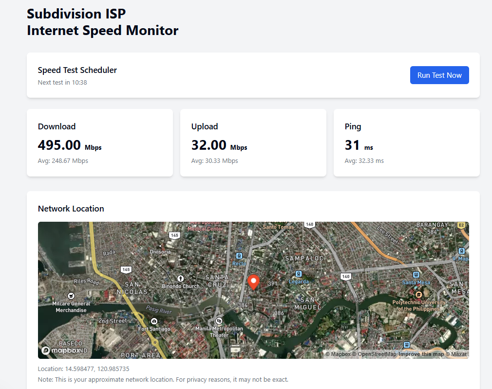

# Network Speed Monitor

A modern Next.js application for monitoring and visualizing your internet connection performance over time. This tool runs speed tests at regular intervals, tracks historical data, and provides insights into your network's health.



## Features

- 🚀 **Automated Speed Testing**: Runs tests every 15 minutes to track your connection performance
- 📊 **Visual Analytics**: Beautiful charts showing download, upload, and ping trends
- 🌎 **Network Location**: Map visualization of your approximate network location
- 🔄 **Real-time Updates**: See your latest speed test results immediately
- 📱 **Service-specific Ping**: Monitor connectivity to popular social media and gaming platforms
- 🌓 **Dark/Light Mode**: Supports system theme preferences
- 📈 **Historical Data**: Track performance over time to identify issues

## Getting Started

### Prerequisites

- Node.js 18.x or later
- npm or yarn

### Installation

1. Clone the repository:
   ```bash
   git clone https://github.com/yourusername/network-speed-monitor.git
   cd network-speed-monitor
   ```

2. Install dependencies:
   ```bash
   npm install
   # or
   yarn install
   ```

3. Create a `.env.local` file in the root directory and add your Mapbox token:
   ```
   NEXT_PUBLIC_MAPBOX_TOKEN=your_mapbox_token_here
   ```
   You can get a free Mapbox token by signing up at [mapbox.com](https://account.mapbox.com/)

4. Start the development server:
   ```bash
   npm run dev
   # or
   yarn dev
   ```

5. Open [http://localhost:3000](http://localhost:3000) in your browser to see the application.

## Deployment

This application can be easily deployed to Vercel:

[](https://vercel.com/new/clone?repository-url=https%3A%2F%2Fgithub.com%2Fyourusername%2Fnetwork-speed-monitor)

For other deployment options, build the application first:

```bash
npm run build
# or
yarn build
```

Then start the production server:

```bash
npm start
# or
yarn start
```

## Customization

### Adding More Services to Monitor

Edit the `SERVICES` object in `src/app/api/speedtest/route.js` to add more services:

```javascript
const SERVICES = {
  social: [
    // Existing services...
    { name: 'LinkedIn', host: 'linkedin.com' },
  ],
  games: [
    // Existing services...
    { name: 'Nintendo', host: 'nintendo.com' },
  ],
  // Add new categories
  streaming: [
    { name: 'Netflix', host: 'netflix.com' },
    { name: 'Disney+', host: 'disneyplus.com' },
  ]
};
```

### Changing Test Frequency

To change how often tests run, modify the interval in `src/components/SpeedTestScheduler.js`:

```javascript
// Change 15 * 60 * 1000 (15 minutes) to your desired interval in milliseconds
const intervalId = setInterval(() => {
  runSpeedTest();
}, 15 * 60 * 1000);
```

## Technical Details

This application is built with:

- **Next.js**: React framework for server-rendered applications
- **Shadcn UI**: Component library for beautiful UI elements
- **Recharts**: Composable charting library for React
- **Mapbox GL**: Interactive, customizable maps
- **SWR**: React Hooks for data fetching
- **TailwindCSS**: Utility-first CSS framework

## Privacy Considerations

This application:
- Only stores speed test data in memory (or your chosen database if configured)
- Displays approximate network location, not your exact physical location
- Does not share your data with third parties

## Contributing

Contributions are welcome! Please feel free to submit a Pull Request.

1. Fork the repository
2. Create your feature branch (`git checkout -b feature/amazing-feature`)
3. Commit your changes (`git commit -m 'Add some amazing feature'`)
4. Push to the branch (`git push origin feature/amazing-feature`)
5. Open a Pull Request

## License

This project is licensed under the MIT License - see the [LICENSE](LICENSE) file for details.

## Acknowledgments

- Speed test simulation inspired by various open-source network testing tools
- UI design influenced by modern dashboard applications
- Map visualization powered by Mapbox

---

Made with ❤️ by Harry Chistian
